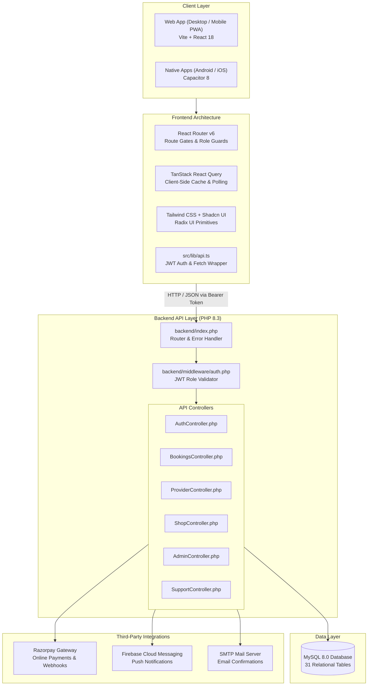
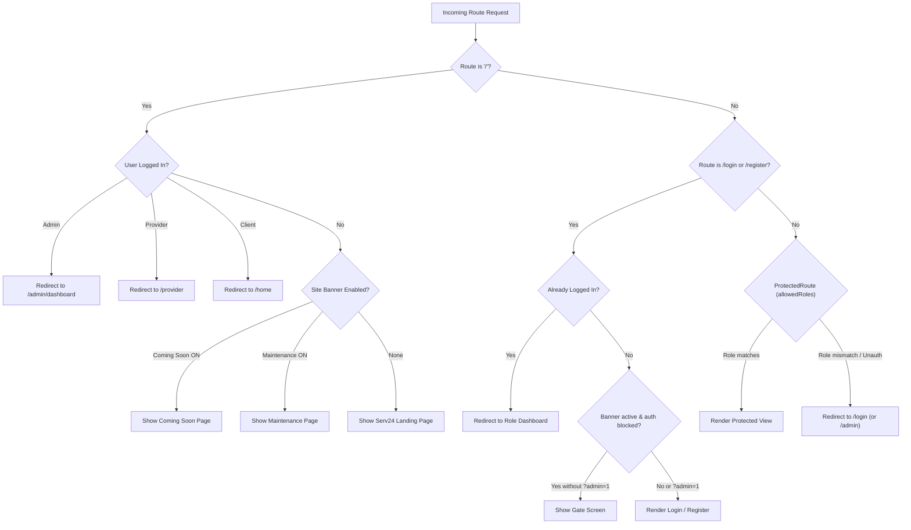
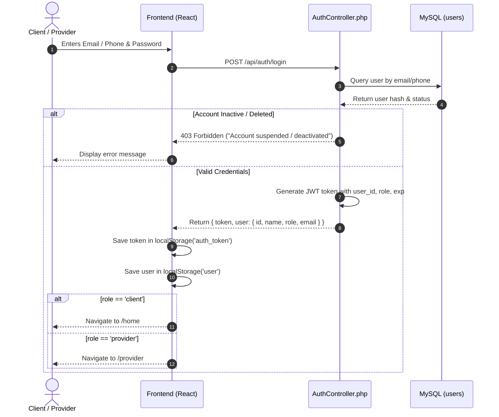
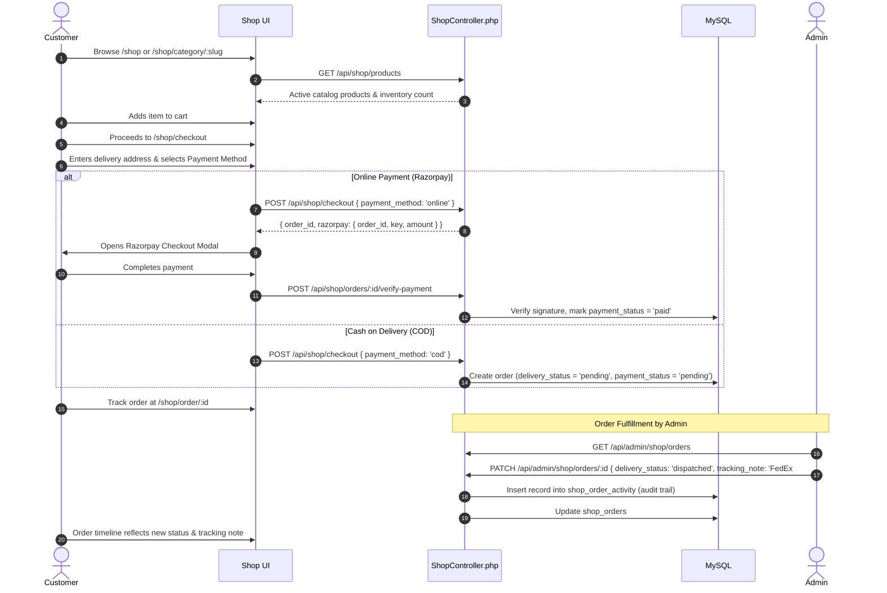
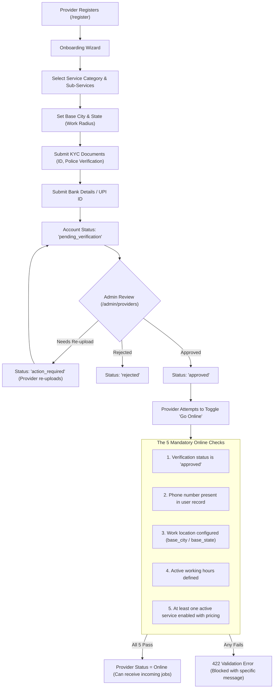
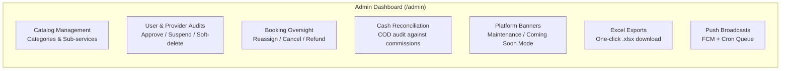

# Serv24 — End-to-End System Flow & Architecture Documentation

> **Project**: Serv24 (On-Demand Home Services & E-Commerce Platform)  
> **Repository**: `task-home-hero-main`  
> **Frontend**: React 18 (TypeScript) + Vite + Tailwind CSS + Shadcn UI  
> **Mobile**: Capacitor 8 (Android & iOS)  
> **Backend**: PHP 8.3 REST API (Custom Router + Controllers + PDO MySQL)  
> **Database**: MySQL (31 Tables)  
> **Payment Gateway**: Razorpay  
> **Notifications**: Firebase Cloud Messaging (FCM) + Email (SMTP) + SMS  

---

## 1. System High-Level Architecture

The Serv24 platform provides a unified system for home service booking, provider job dispatch, e-commerce shopping, and administrative management.



---

## 2. User Roles & Authorization Matrix

The application handles three authenticated user roles and one guest state:

| Role | Default Entry Point | Dashboard / Home Path | Capabilities |
| :--- | :--- | :--- | :--- |
| **Guest / Visitor** | `/` | `/` (or Coming Soon / Maintenance) | Browse categories, view landing page, subscribe to newsletter, access login/register. |
| **Client / Customer** | `/login`, `/register` | `/home` | Search services, book providers, real-time booking chat, OTP completion, e-commerce shop, order tracking, support tickets. |
| **Service Provider** | `/login`, `/register` | `/provider` | Onboarding wizard, document upload (KYC), toggle online duty, receive job alerts, accept/reject jobs, progress job status with OTP + photo upload, wallet & payouts. |
| **Administrator** | `/admin` | `/admin/dashboard` | Platform metrics, category & sub-service catalog CRUD, approve/reject providers, manage bookings, approve withdrawals, audit cash collections, manage shop catalog & orders, site banners. |

### Routing & Guard Architecture



---

## 3. Workflow 1: Authentication & Identity Lifecycle

Serv24 uses a unified authentication model for Clients and Providers with JWT tokens. The Admin portal has an isolated login path.



### Key Rules:
- **Social Login**: Google OAuth (`POST /api/auth/google`) exchanges an ID token for a Serv24 JWT. If the user is new, a client account is created automatically.
- **Deactivation Hook**: If an account is suspended or deleted by an admin, background API calls fail with `401 Unauthorized`, immediately clearing local storage and forcing a redirect to `/login` within 30 seconds.
- **Admin Isolation**: Admin users log in exclusively via `/admin` (`POST /api/auth/login`), completely separated from public forms.

---

## 4. Workflow 2: Service Booking Lifecycle (Client ↔ Provider)

The primary service booking lifecycle connects clients with verified local service providers.

```mermaid
sequenceDiagram
    autonumber
    actor Client
    participant FE as Client UI
    participant API as BookingsController
    participant DB as MySQL
    participant ProvFE as Provider UI / Overlay
    actor Provider

    Client->>FE: Selects Category & Sub-Service
    FE->>API: GET /api/services/providers/search?category_id=...
    API-->>FE: Available providers & custom pricing
    Client->>FE: Chooses Provider, Date, Time & Address
    Client->>FE: Selects COD or Online Payment
    FE->>API: POST /api/bookings
    API->>DB: Insert booking (status = 'pending')
    API-->>FE: Booking created ({ id, booking_number })
    
    Note over API,ProvFE: Job dispatch via polling (10s) & push notification
    ProvFE->>API: GET /api/provider/incoming-jobs
    API-->>ProvFE: Incoming booking details
    ProvFE->>Provider: Audible alert + ProviderIncomingJobOverlay modal
    
    alt Provider Rejects
        Provider->>ProvFE: Clicks Reject
        ProvFE->>API: POST /api/provider/jobs/:id/reject
        API->>DB: Mark rejected for this provider; re-dispatch
    else Provider Accepts
        Provider->>ProvFE: Clicks Accept
        ProvFE->>API: POST /api/provider/jobs/:id/accept
        API->>DB: Update status = 'accepted', provider_id assigned
        API-->>ProvFE: Customer contact details unlocked
    end

    Note over Client,Provider: Progression through Job Stages
    Provider->>ProvFE: Updates to "On the Way"
    ProvFE->>API: PATCH /api/provider/jobs/:id/status { status: 'on_the_way' }
    
    Provider->>ProvFE: Updates to "In Progress" (Starts Job)
    ProvFE->>API: PATCH /api/provider/jobs/:id/status { status: 'in_progress' }
    
    Note over Client,Provider: Completion Verification Stage
    API->>DB: Generate 4-digit completion OTP
    Client-->>Provider: Shares 4-digit completion OTP
    Provider->>ProvFE: Enters 4-digit OTP + Uploads 2 work completion photos
    ProvFE->>API: POST /api/provider/jobs/:id/complete-with-otp (multipart/form-data)
    API->>DB: Verify OTP, mark is_used=1, save photos, status = 'completed'
    
    alt Payment is COD
        Provider->>ProvFE: Confirms cash collection
        ProvFE->>API: POST /api/provider/jobs/:id/collect-cash
        API->>DB: Record cash collection transaction
    end

    Client->>FE: Rates & reviews provider (1-5 stars)
    FE->>API: POST /api/bookings/:id/review
    API->>DB: Store immutable review & recalculate provider average rating
```

### Live Booking Chat Architecture
- **Active Polling**: `use-booking-chat.ts` polls `GET /api/bookings/:id/chat` every 4 seconds.
- **Typing Indicator**: Debounced to 250ms on input; posts to `POST /api/bookings/:id/chat/typing` with a 3-second server-side TTL file cache (`backend/cache/chat/{bookingId}.json`).
- **Read Receipts**: Status transitions: `sending` $\rightarrow$ `sent` $\rightarrow$ `delivered` $\rightarrow$ `read` (tracked via `read_at` timestamp).

---

## 5. Workflow 3: E-Commerce Shop & Order Fulfillment

The e-commerce store is an independent module for purchasing tools, materials, and spare parts.



### Order Delivery Status Flow:
$$\text{pending} \longrightarrow \text{confirmed} \longrightarrow \text{dispatched} \longrightarrow \text{out\_for\_delivery} \longrightarrow \text{delivered}$$
*(Cancelled orders can be triggered from pending or confirmed states).*

---

## 6. Workflow 4: Provider Onboarding, KYC & Financial Operations

Before a service provider can accept jobs, they must pass strict verification and meet 5 mandatory requirements.



### Provider Earnings & Wallet Breakdown
1. **COD Earnings**: Collected in cash directly from clients. The platform commission is tracked as a debit balance owed by the provider.
2. **Online Earnings**: Collected digitally into the platform escrow.
3. **Withdrawal Requests**:
   - Provider navigates to `/provider/wallet`.
   - Minimum withdrawal amount: **₹100**.
   - Admin reviews the request at `/admin/withdrawals`.
   - Admin marks request as `approved` (funds transferred via NEFT/UPI) or `rejected` with an explanatory note.

---

## 7. Workflow 5: Admin Platform Governance & Maintenance

Administrators have central control over operations, platform status, and data reporting.



### Platform Banner Control Matrix
- **Coming Soon Mode**: Active when `banner_coming_soon_enabled === '1'`. Displays countdown timer, feature preview, and newsletter lead capture form (`POST /api/subscribe`).
- **Maintenance Mode**: Active when `banner_maintenance_enabled === '1'`. Informs visitors of planned updates.
- **Admin Bypass**: When banners are enabled, public routes (`/login`, `/register`) can be bypassed by appending `?admin=1` to the URL.

---

## 8. REST API Master Directory (Grouped by Flow)

| Flow Domain | Method | Endpoint | Access Level | Description |
| :--- | :---: | :--- | :---: | :--- |
| **Auth** | `POST` | `/api/auth/register` | Public | Register client or provider account |
| | `POST` | `/api/auth/login` | Public | Authenticate user & issue JWT |
| | `POST` | `/api/auth/google` | Public | Google OAuth token verification |
| | `GET` | `/api/auth/profile` | Authenticated | Retrieve authenticated user profile |
| | `PUT` | `/api/auth/profile` | Authenticated | Update user name, phone, or avatar |
| **Services** | `GET` | `/api/services/categories` | Public | List active service categories |
| | `GET` | `/api/services/categories/:id/sub-services` | Public | List sub-services for a category |
| | `GET` | `/api/services/providers/search` | Client | Search providers by category & location |
| **Bookings** | `POST` | `/api/bookings` | Client | Create a new service booking |
| | `GET` | `/api/bookings/my` | Client | Get booking history for client |
| | `GET` | `/api/bookings/:id` | Client / Provider | Get detailed booking information |
| | `POST` | `/api/bookings/:id/cancel` | Client / Admin | Cancel a booking with reason |
| | `POST` | `/api/bookings/:id/review` | Client | Submit rating and review |
| **Provider** | `PATCH`| `/api/provider/online-status` | Provider | Toggle online duty (enforces 5 prerequisites) |
| | `GET` | `/api/provider/incoming-jobs` | Provider | Poll for new job alerts |
| | `POST` | `/api/provider/jobs/:id/accept` | Provider | Accept an incoming job |
| | `PATCH`| `/api/provider/jobs/:id/status` | Provider | Advance job state (`on_the_way`, `in_progress`) |
| | `POST` | `/api/provider/jobs/:id/complete-with-otp`| Provider | Submit 4-digit OTP & 2 completion photos |
| | `POST` | `/api/provider/jobs/:id/collect-cash` | Provider | Confirm receipt of COD payment |
| | `POST` | `/api/provider/payout` | Provider | Request wallet withdrawal |
| **Shop** | `GET` | `/api/shop/products` | Client | Browse product catalog with filters |
| | `GET` | `/api/shop/cart` | Client | Fetch current shopping cart items |
| | `POST` | `/api/shop/checkout` | Client | Generate shop order (COD or Online) |
| | `POST` | `/api/shop/orders/:id/verify-payment` | Client | Validate Razorpay payment signature |
| | `GET` | `/api/shop/orders/:id` | Client / Admin | View order status & delivery activity log |
| **Admin** | `GET` | `/api/admin/dashboard` | Admin | Overall business KPIs and statistics |
| | `GET` | `/api/admin/analytics` | Admin | Date-filtered financial & booking charts |
| | `POST` | `/api/admin/providers/:id/approve` | Admin | Approve provider KYC documents |
| | `POST` | `/api/admin/providers/:id/suspend` | Admin | Suspend provider account |
| | `GET` | `/api/admin/cash-summary` | Admin | COD cash reconciliation overview |
| | `POST` | `/api/admin/payouts/:id/approve` | Admin | Approve provider withdrawal request |
| | `PUT` | `/api/admin/settings` | Admin | Update site settings (banners, fees, etc.) |

---

## 9. Database Entity Relationship Overview

The MySQL database contains **31 tables** structured around these key entities:

```
users (id, name, email, phone, role, status)
 ├── user_addresses (user_id, address_line1, city, state, pincode)
 ├── provider_profiles (user_id, base_city, base_state, verification_status, is_online)
 │    ├── provider_documents (provider_id, document_type, document_url, status)
 │    ├── provider_services (provider_id, sub_service_id, custom_price)
 │    ├── provider_availability (provider_id, day_of_week, start_time, end_time)
 │    └── provider_payout_details (provider_id, account_number, ifsc_code, upi_id)
 ├── bookings (client_id, provider_id, sub_service_id, status, payment_method, payment_status)
 │    ├── booking_status_history (booking_id, old_status, new_status, changed_by)
 │    ├── booking_messages (booking_id, sender_id, message, read_at)
 │    ├── completion_otps (booking_id, otp_code, is_used, expires_at)
 │    └── reviews (booking_id, client_id, provider_id, rating, review_text)
 ├── transactions (booking_id, user_id, amount, type, status)
 ├── payout_requests (provider_id, amount, status, admin_notes)
 └── shop_orders (client_id, order_number, total, payment_status, delivery_status)
      ├── shop_order_items (order_id, product_id, quantity, price)
      └── shop_order_activity (order_id, field_changed, old_value, new_value, note)
```

---

## 10. Local Development & Deployment Environment

### Local Development Setup
1. **Environment Configuration**: Set backend base URL in `.env`:
   ```env
   VITE_API_BASE_URL=https://serv24.in/api
   ```
2. **Install Packages**:
   ```bash
   npm install
   ```
3. **Start Dev Server**:
   ```bash
   npm run dev
   ```
   Server starts at `http://localhost:8080/`.

### Production Deployment
- **Frontend**: Run `npm run build` to generate compiled static assets in `dist/`.
- **Backend**: Upload `backend/` folder to web root at `public_html/api/` on PHP 8.2+ hosting with MySQL.
- **Installer**: First-time initialization via `https://yourdomain.com/api/install.php` auto-migrates all 31 tables.
